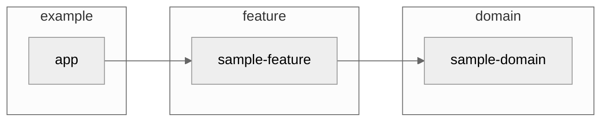

```mermaid
%%{
  init: {
    'theme': 'neutral'
  }
}%%

graph LR
  subgraph example
    app
  end
  subgraph domain
    sample-domain
  end
  subgraph feature
    sample-feature
  end
  app --> sample-feature
  sample-feature --> sample-domain

```
